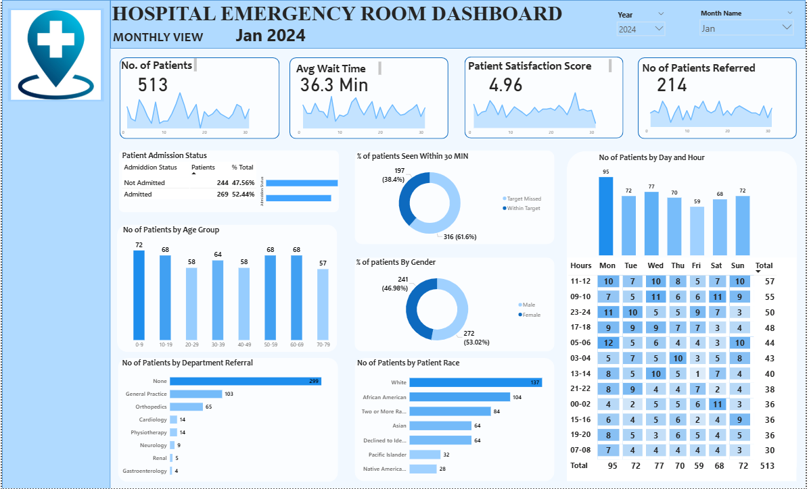
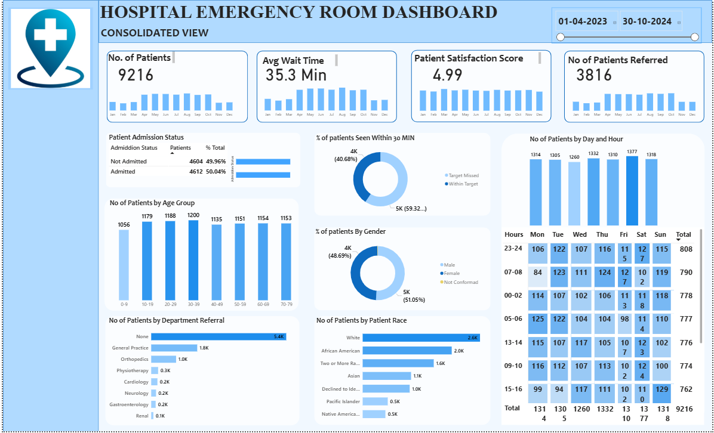
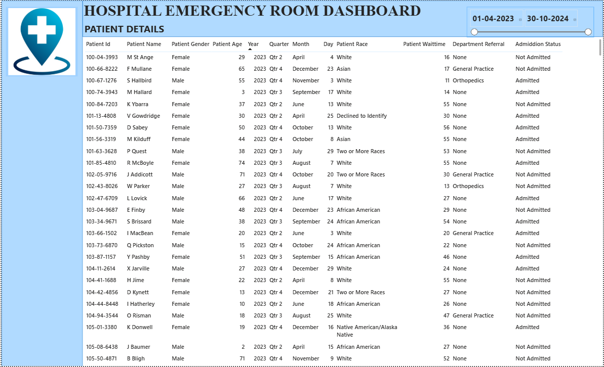

# 🏥 Hospital Emergency Room Dashboard – Power BI Project

> 📊 An interactive Power BI dashboard visualizing hospital emergency room (ER) performance to improve operational efficiency and patient care outcomes.

---

## 📘 1. Project Overview

This project provides a **comprehensive analysis** of emergency room operations using Power BI.  
It tracks trends in patient admissions, departmental load, and patient-level details to help administrators make **data-driven decisions**.  

---

## 📂 2. Project Context

Emergency Rooms are high-pressure environments with **high patient inflow and limited resources**.  
This project demonstrates **real-world ER analytics** by visualizing trends, bottlenecks, and operational efficiency across different dashboards.

---

## 🎯 3. Project Goals

- Track **daily, monthly, and overall ER trends**  
- Analyze **departmental workload and referral patterns**  
- Measure **key performance indicators (KPIs)**:  
  - Wait Time  
  - Timeliness  
  - Patient Satisfaction  
- Provide **interactive filtering and drill-downs** using slicers and visuals  

---

## ✨ 4. Dashboards & Features

### 1️⃣ Monthly View Dashboard
  

**Description:**  
- Shows **monthly patient admission and discharge trends**  
- Tracks department-wise referrals and workloads  
- Visualizes seasonal patterns and peak periods  
- Includes interactive filters for department, patient type, and admission category  

**Insights Provided:**  
- Identify busiest months and seasonal trends  
- Monitor departmental efficiency and resource allocation  

---

### 2️⃣ Consolidated View Dashboard
  

**Description:**  
- Provides a **holistic snapshot** of ER performance  
- Displays total admissions, patient flow, and bed occupancy  
- Highlights daily and weekly trends  
- Supports quick overview of KPIs in a single view  

**Insights Provided:**  
- Identify bottlenecks in patient flow  
- Monitor overall ER efficiency  
- Evaluate resource utilization across departments  

---

### 3️⃣ Patient Details Dashboard
  

**Description:**  
- Provides **detailed patient-level information**  
- Includes demographics, admission type, and status  
- Useful for operational decisions, reporting, and audits  

**Insights Provided:**  
- Analyze individual patient data  
- Track patient distribution across departments  
- Identify patterns affecting wait times and satisfaction  

---

## 💥 5. Project Impact

- Helps hospitals **plan resources** and allocate staff efficiently  
- Reduces **patient wait times** by identifying peak periods  
- Enables **data-driven decisions** to improve service quality  
- Demonstrates **Power BI, DAX, and Power Query** applied in healthcare analytics  
- Strengthens **Data Analyst / BI portfolio**

---

## 🤝 6. Author

**Devendra Reddy Vennapusa**  
- 💼 [LinkedIn](https://www.linkedin.com/in/devendra-reddy-vennapusa)  
- 💻 [GitHub](https://github.com/devendrareddy2344)  
- 📸 [Instagram](https://www.instagram.com/devendra_reddy02/)  

---

## 📁 Repository Contents

| File | Description |
|------|-------------|
| `Hospital ER_Data.csv` | Raw hospital ER dataset |
| `Hospital.pbix` | Power BI file with interactive dashboards |
| `DashBoard-image/Monthly-view.png` | Screenshot of Monthly View dashboard |
| `DashBoard-image/Consolidated-view.png` | Screenshot of Consolidated View dashboard |
| `DashBoard-image/Patient_Details.png` | Screenshot of Patient Details dashboard |
| `Problem statement PPT.pptx` | Project requirements and plan |

---

## 🛠️ Tech Stack

- **Power BI** – Data modeling, dashboard design  
- **Power Query** – Data cleaning and transformation  
- **DAX** – KPI calculations and time intelligence  
- **CSV Dataset** – Raw hospital data  

---

## 🚀 How to Use

1. Clone/download the repository  
2. Open `Hospital.pbix` in **Power BI Desktop**  
3. Explore the **Monthly, Consolidated, and Patient Details Dashboards**  
4. Use slicers and filters to analyze trends, patient flow, and departmental performance  

---

## 🔖 Tags & Topics

`PowerBI` `Healthcare Analytics` `Data Visualization` `Hospital Dashboard` `Monthly Trends` `Business Intelligence` `Patient Management`
